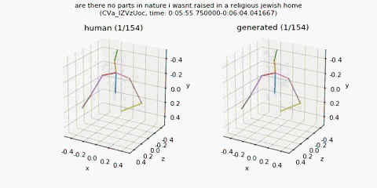
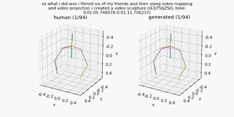

# Learning Hierarchical Cross-Modal Association for Co-Speech Gesture Generation (CVPR 2022)

[Xian Liu](https://alvinliu0.github.io/), [Qianyi Wu](https://wuqianyi.top/), [Hang Zhou](https://hangz-nju-cuhk.github.io/), [Yinghao Xu](https://justimyhxu.github.io/), [Rui Qian](https://shvdiwnkozbw.github.io/), [Xinyi Lin](https://alvinliu0.github.io/), [Xiaowei Zhou](https://xzhou.me/), [Wayne Wu](https://wywu.github.io/), [Bo Dai](http://daibo.info/), [Bolei Zhou](http://bzhou.ie.cuhk.edu.hk/).

### [Project](https://alvinliu0.github.io/projects/HA2G) | [Paper](https://arxiv.org/pdf/2203.13161.pdf) | [Demo](https://www.youtube.com/watch?v=CG632W-nIWk) | [Data](https://mycuhk-my.sharepoint.com/:u:/g/personal/1155165198_link_cuhk_edu_hk/EQhOOXYsZDhJs-oEVwA7oyABSrkwcTKC6kwX-A85r0-42g?e=BiIsV1)

Generating speech-consistent body and gesture movements is a long-standing problem in virtual avatar creation. Previous studies often synthesize pose movement in a holistic manner, where poses of all joints are generated simultaneously. Such a straightforward pipeline fails to generate fine-grained co-speech gestures. One observation is that the hierarchical semantics in speech and the hierarchical structures of human gestures can be naturally described into multiple granularities and associated together. To fully utilize the rich connections between speech audio and human gestures, we propose a novel framework named **Hierarchical Audio-to-Gesture (HA2G)** for co-speech gesture generation. In HA2G, a Hierarchical Audio Learner extracts audio representations across semantic granularities. A Hierarchical Pose Inferer subsequently renders the entire human pose gradually in a hierarchical manner. To enhance the quality of synthesized gestures, we develop a contrastive learning strategy based on audio-text alignment for better audio representations. Extensive experiments and human evaluation demonstrate that the proposed method renders realistic co-speech gestures and outperforms previous methods in a clear margin.


## Environment

This project is developed and tested on Ubuntu 18.04, Python 3.6, PyTorch 1.10.2 and CUDA version 11.3. Since the repository is developed based on [Gesture Generation from Trimodal Context](https://github.com/ai4r/Gesture-Generation-from-Trimodal-Context) of Yoon et al., the environment requirements, installation and dataset preparation process generally follow theirs.

## Installation

1. Clone this repository:
   ```
   git clone https://github.com/alvinliu0/HA2G.git
   ```

2. Install required python packages:
   ```
   pip install -r requirements.txt
   ```

3. Install Gentle for audio-transcript alignment. Download the source code from [Gentle github](https://github.com/lowerquality/gentle) and install the library via `install.sh`. And then, you can import gentle library by specifying the path to the library at `script/synthesize.py` line 27.

4. Download pretrained fasttext model from [here](https://dl.fbaipublicfiles.com/fasttext/vectors-english/crawl-300d-2M-subword.zip) and put `crawl-300d-2M-subword.bin` and `crawl-300d-2M-subword.vec` at `data/fasttext/`.

5. Download the pretrained co-speech gesture models, which include the following:

* [TED Expressive Dataset Auto-Encoder](https://mycuhk-my.sharepoint.com/:u:/g/personal/1155165198_link_cuhk_edu_hk/EWbBxUeuIHFDnBUgZFMCq1oBdiZSw6pOlmVxC8d9xS3HOg?e=IT1AoC), which is used to evaluate the FGD metric;

* [TED Gesture Dataset Pretrained Model](https://mycuhk-my.sharepoint.com/:u:/g/personal/1155165198_link_cuhk_edu_hk/EWNjGPct4vJFq1nXccRi8OsBYmy62FugwGE_eRRqt0siDw?e=lGbjxp), which is the HA2G model trained on the TED Gesture Dataset;

* [TED Expressive Dataset Pretrained Model](https://mycuhk-my.sharepoint.com/:u:/g/personal/1155165198_link_cuhk_edu_hk/EXtwgK2itnpGmE8fkMjrfccBmw4l3zsTDfhAb_PKw1aXdA), which is the HA2G model trained on the TED Expressive Dataset.

## TED Expressive Dataset

Download [the preprocessed TED Expressive dataset](https://mycuhk-my.sharepoint.com/:u:/g/personal/1155165198_link_cuhk_edu_hk/EQhOOXYsZDhJs-oEVwA7oyABSrkwcTKC6kwX-A85r0-42g?e=BiIsV1) (16GB) and extract the ZIP file into `data/ted_expressive_dataset`. 

You can find out the details of the TED Expressive dataset from [here](https://github.com/alvinliu0/HA2G/blob/main/dataset_script/README.md). The dataset pre-processing are extended based on [youtube-gesture-dataset](https://github.com/youngwoo-yoon/youtube-gesture-dataset). Our dataset extends new features of 3D upper body keypoints annotations including fine-grained fingers.

## TED Gesture Dataset

Our codebase also supports the training and inference of TED Gesture dataset of Yoon et al. Download [the preprocessed TED Gesture dataset](https://kaistackr-my.sharepoint.com/:u:/g/personal/zeroyy_kaist_ac_kr/EYAPLf8Hvn9Oq9GMljHDTK4BRab7rl9hAOcnjkriqL8qSg) (16GB) and extract the ZIP file into `data/ted_gesture_dataset`. Please refer to [here](https://github.com/youngwoo-yoon/youtube-gesture-dataset) for the details of TED Gesture dataset.

## Pretrained Models and Training Logs

We also provide the pretrained models and training logs for better reproducibility and further research in this community. Note that since this work was done during internship at SenseTime Research, only the original training logs are provided while the original pretrained models are unavailble. Instead, we provide the newly pretrained models as well as the corresponding training logs. The new models outperform the evaluation results reported in the paper.

Pretrained models contain:

* [TED Gesture Dataset Pretrained Model](https://mycuhk-my.sharepoint.com/:u:/g/personal/1155165198_link_cuhk_edu_hk/EWNjGPct4vJFq1nXccRi8OsBYmy62FugwGE_eRRqt0siDw?e=lGbjxp), which is the HA2G model trained on the TED Gesture Dataset;

* [TED Expressive Dataset Pretrained Model](https://mycuhk-my.sharepoint.com/:u:/g/personal/1155165198_link_cuhk_edu_hk/EXtwgK2itnpGmE8fkMjrfccBmw4l3zsTDfhAb_PKw1aXdA), which is the HA2G model trained on the TED Expressive Dataset.

Training logs contain:

* [ted_gesture_original.log](https://github.com/alvinliu0/HA2G/blob/main/training_logs/ted_gesture_original.log), which is the original HA2G training log on TED Gesture dataset;

* [ted_gesture_new.log](https://github.com/alvinliu0/HA2G/blob/main/training_logs/ted_gesture_new.log), which is the newly trained HA2G log on TED Gesture dataset;

* [ted_expressive_original.log](https://github.com/alvinliu0/HA2G/blob/main/training_logs/ted_expressive_original.log), which is the original HA2G training log on TED Expressive dataset;

* [ted_expressive_new.log](https://github.com/alvinliu0/HA2G/blob/main/training_logs/ted_expressive_new.log), which is the newly trained HA2G log on TED Expressive dataset.

## Synthesize from TED speech

Generate gestures from a clip in the **TED Gesture testset** using **baseline** models: 

```
python scripts/synthesize.py from_db_clip [trained model path] [number of samples to generate]
```

You would run like this:

```
python scripts/synthesize.py from_db_clip output/train_multimodal_context/multimodal_context_checkpoint_best.bin 10
```

Generate gestures from a clip in the **TED Gesture testset** using **HA2G** models: 

```
python scripts/synthesize_hierarchy.py from_db_clip [trained model path] [number of samples to generate]
```

You would run like this:

```
python scripts/synthesize_hierarchy.py from_db_clip TED-Gesture-output/train_hierarchy/ted_gesture_hierarchy_checkpoint_best.bin 10
```

Generate gestures from a clip in the **TED Expressive testset** using **HA2G** models: 

```
python scripts/synthesize_expressive_hierarchy.py from_db_clip [trained model path] [number of samples to generate]
```

You would run like this:

```
python scripts/synthesize_expressive_hierarchy.py from_db_clip TED-Expressive-output/train_hierarchy/ted_expressive_hierarchy_checkpoint_best.bin 10
```

The first run takes several minutes to cache the datset. After that, it runs quickly.   
You can find synthesized results in `output/generation_results`. There are MP4, WAV, and PKL files for visualized output, audio, and pickled raw results, respectively. Speaker IDs are randomly selected for each generation. The following shows sample MP4 files.




## Training

Train the proposed HA2G model on TED Gesture Dataset:
```
python scripts/train.py --config=config/hierarchy.yml
```

And the baseline models on TED Gesture Dataset:

```
python scripts/train.py --config=config/seq2seq.yml
python scripts/train.py --config=config/speech2gesture.yml
python scripts/train.py --config=config/joint_embed.yml 
python scripts/train.py --config=config/multimodal_context.yml
```

For the TED Expressive Dataset, you can train the HA2G model by:
```
python scripts/train_expressive.py --config=config_expressive/hierarchy.yml
```

And the baseline models on TED Expressive Dataset:

```
python scripts/train.py --config=config_expressive/seq2seq.yml
python scripts/train.py --config=config_expressive/speech2gesture.yml
python scripts/train.py --config=config_expressive/joint_embed.yml 
python scripts/train.py --config=config_expressive/multimodal_context.yml
```

Caching TED training set (`lmdb_train`) takes tens of minutes at your first run. Model checkpoints and sample results will be saved in subdirectories of `./TED-Gesture-output` and `./TED-Expressive-output` folder.

Note on reproducibility:  
unfortunately, we didn't fix a random seed, so you are not able to reproduce the same FGD in the paper. But, several runs with different random seeds mostly fell in a similar FGD range.

### Fréchet Gesture Distance (FGD)

You can train the autoencoder used for FGD. However, please note that FGD will change as you train the autoencoder anew. We recommend you to stick to the checkpoint that we shared.
 
1. For the TED Gesture Dataset, we use the pretrained Auto-Encoder model provided by Yoon et al. for better reproducibility [the ckpt in the train_h36m_gesture_autoencoder folder](https://kaistackr-my.sharepoint.com/:u:/g/personal/zeroyy_kaist_ac_kr/Ec1UIsDDLHtKia04_TTRbygBepXORv__kkq-C9IqZs32aA?e=bJGXQr).

2. For the TED Expressive Dataset, the pretrained Auto-Encoder model is provided [here](https://mycuhk-my.sharepoint.com/:u:/g/personal/1155165198_link_cuhk_edu_hk/EWbBxUeuIHFDnBUgZFMCq1oBdiZSw6pOlmVxC8d9xS3HOg?e=IT1AoC). If you want to train the autoencoder anew, you could run the following training script:
   
```
python scripts/train_feature_extractor_expressive.py --config=config_expressive/gesture_autoencoder.yml
```

The model checkpoints will be saved in `./TED-Expressive-output/AE-cos1e-3`.

## License

We follow the GPL-3.0 license, please see details [here](https://github.com/alvinliu0/HA2G/blob/main/license).

## Citation

If you find our work useful, please kindly cite as:
```
@inproceedings{liu2022learning,
  title={Learning Hierarchical Cross-Modal Association for Co-Speech Gesture Generation},
  author={Liu, Xian and Wu, Qianyi and Zhou, Hang and Xu, Yinghao and Qian, Rui and Lin, Xinyi and Zhou, Xiaowei and Wu, Wayne and Dai, Bo and Zhou, Bolei},
  booktitle={Proceedings of the IEEE/CVF Conference on Computer Vision and Pattern Recognition},
  pages={10462--10472},
  year={2022}
}
```

## Acknowledgement
* The codebase is developed based on [Gesture Generation from Trimodal Context](https://github.com/ai4r/Gesture-Generation-from-Trimodal-Context) of Yoon et al.