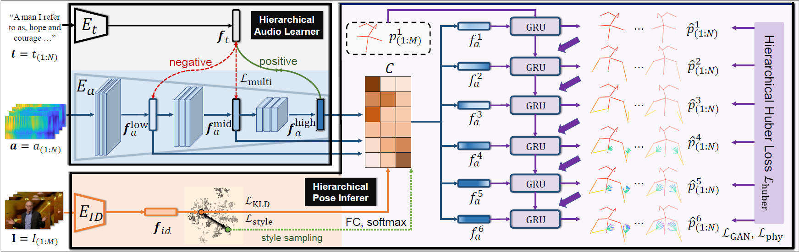

# Learning Hierarchical Cross-Modal Association for Co-Speech Gesture Generation (CVPR 2022)

[Xian Liu](https://alvinliu0.github.io/), [Qianyi Wu](https://wuqianyi.top/), [Hang Zhou](https://hangz-nju-cuhk.github.io/), [Yinghao Xu](https://justimyhxu.github.io/), [Rui Qian](https://shvdiwnkozbw.github.io/), [Xinyi Lin](https://alvinliu0.github.io/), [Xiaowei Zhou](https://xzhou.me/), [Wayne Wu](https://wywu.github.io/), [Bo Dai](http://daibo.info/), and [Bolei Zhou](http://bzhou.ie.cuhk.edu.hk/).

### [Project](https://alvinliu0.github.io/projects/HA2G) | [Paper](https://arxiv.org/pdf/2203.13161.pdf) | [Demo](https://www.youtube.com/watch?v=CG632W-nIWk)

Generating speech-consistent body and gesture movements is a long-standing problem in virtual avatar creation. Previous studies often synthesize pose movement in a holistic manner, where poses of all joints are generated simultaneously. Such a straightforward pipeline fails to generate fine-grained co-speech gestures. One observation is that the hierarchical semantics in speech and the hierarchical structures of human gestures can be naturally described into multiple granularities and associated together. To fully utilize the rich connections between speech audio and human gestures, we propose a novel framework named **Hierarchical Audio-to-Gesture (HA2G)** for co-speech gesture generation. In HA2G, a Hierarchical Audio Learner extracts audio representations across semantic granularities. A Hierarchical Pose Inferer subsequently renders the entire human pose gradually in a hierarchical manner. To enhance the quality of synthesized gestures, we develop a contrastive learning strategy based on audio-text alignment for better audio representations. Extensive experiments and human evaluation demonstrate that the proposed method renders realistic co-speech gestures and outperforms previous methods in a clear margin.



## Environment

This project is developed and tested on Ubuntu 18.04, Python 3.6+, and PyTorch 1.3+. Since the repository is developed based on [Gesture Generation from Trimodal Context](https://github.com/ai4r/Gesture-Generation-from-Trimodal-Context) of Yoon et al., the environment requirements, installation and dataset preparation process generally follow theirs.

## Installation and Dataset Preparation

### Installation

1. Clone this repository:
   ```
   git clone https://github.com/alvinliu0/HA2G.git
   ```

0. Install required python packages:
   ```
   pip install -r requirements.txt
   ```

0. Install Gentle for audio-transcript alignment. Download the source code from [Gentle github](https://github.com/lowerquality/gentle) and install the library via `install.sh`. And then, you can import gentle library by specifying the path to the library at `script/synthesize.py` line 27.

### Dataset Preparation

1. Download [the preprocessed TED Expressive dataset](https://mycuhk-my.sharepoint.com/:u:/g/personal/1155165198_link_cuhk_edu_hk/EQhOOXYsZDhJs-oEVwA7oyABSrkwcTKC6kwX-A85r0-42g?e=BiIsV1) (16GB) and extract the ZIP file into `data/ted_expressive_dataset`. 

You can find out the details of the TED Expressive dataset from [here](https://github.com/alvinliu0/HA2G/dataset_script/README.md). The dataset pre-processing are extended based on [youtube-gesture-dataset](https://github.com/youngwoo-yoon/youtube-gesture-dataset).

0. Download pretrianed fasttext model from [here](https://dl.fbaipublicfiles.com/fasttext/vectors-english/crawl-300d-2M-subword.zip) and put `crawl-300d-2M-subword.bin` and `crawl-300d-2M-subword.vec` at `data/fasttext`.

## Training

The training code is coming soon. Stay tuned!

## Citation

If you find our work useful, please kindly cite as:
```
@inproceedings{liu2022learning,
  title={Learning Hierarchical Cross-Modal Association for Co-Speech Gesture Generation},
  author={Liu, Xian and Wu, Qianyi and Zhou, Hang and Xu, Yinghao and Qian, Rui and Lin, Xinyi and Zhou, Xiaowei and Wu, Wayne and Dai, Bo and Zhou, Bolei},
  booktitle={Proceedings of the IEEE/CVF Conference on Computer Vision and Pattern Recognition},
  pages={10462--10472},
  year={2022}
}
```

## Acknowledgement
* The codebase is developed based on [Gesture Generation from Trimodal Context](https://github.com/ai4r/Gesture-Generation-from-Trimodal-Context) of Yoon et al.